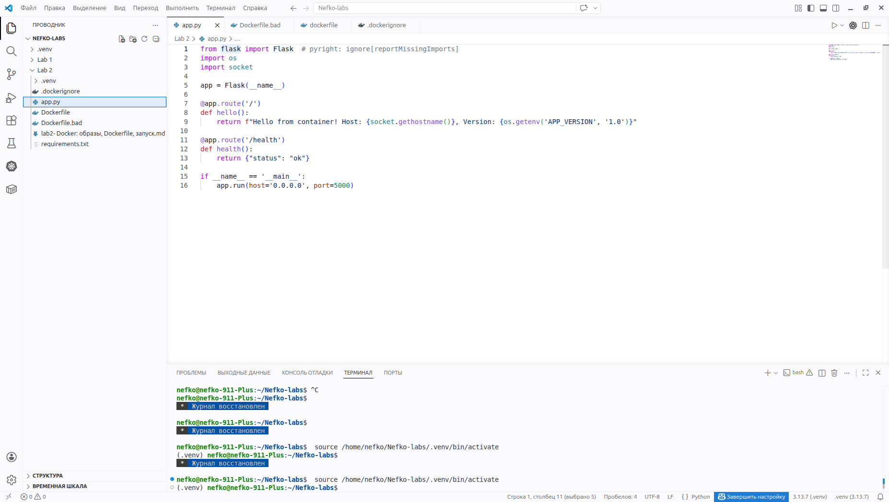
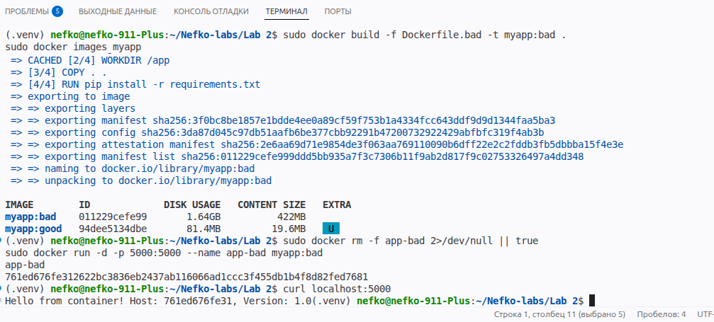

## Блок 1 — Первый Dockerfile

На первом этапе было создано простое Flask-приложение с двумя маршрутами:

* `/` — вывод приветственного сообщения из контейнера;
* `/health` — проверка состояния приложения.

Файл `app.py`:

```python
from flask import Flask
import os
import socket

app = Flask(__name__)

@app.route('/')
def hello():
    return f"Hello from container! Host: {socket.gethostname()}, Version: {os.getenv('APP_VERSION', '1.0')}"

@app.route('/health')
def health():
    return {"status": "ok"}

if __name__ == '__main__':
    app.run(host='0.0.0.0', port=5000)
```

Файл `requirements.txt`:

```txt
flask==3.0.0
```

Был создан Dockerfile с неоптимальной конфигурацией:

```dockerfile
FROM python:3.12
WORKDIR /app
COPY . .
RUN pip install -r requirements.txt
CMD ["python", "app.py"]
```

После сборки образа его размер составил около 1.6 GB, что является избыточным для такого простого приложения.

Контейнер был успешно запущен, и приложение корректно ответило на HTTP-запрос:

```bash
curl localhost:5000
```

Результат:

```
Hello from container! Host: <container_id>, Version: 1.0
```


 